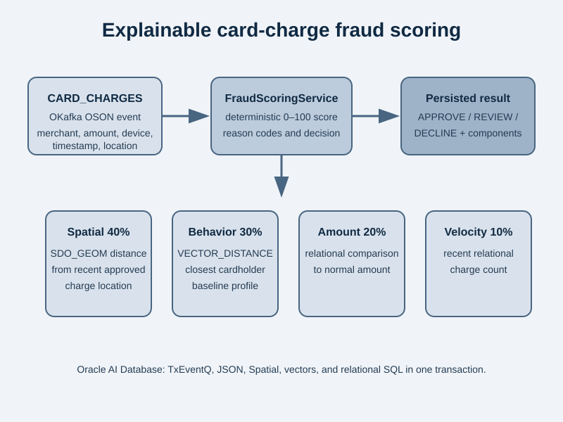

# Credit card fraud detection with OKafka

This sample consumes JSON card-charge events from an OKafka `CARD_CHARGES` topic and persists an explainable fraud assessment in Oracle AI Database. It is deliberately a deterministic teaching example, not a production fraud model.



Each event carries a transaction ID, cardholder, timestamp, amount and currency, merchant/category, channel, device ID, and latitude/longitude. The [FraudScoringService](./src/main/java/com/example/fraud/FraudScoringService.java) combines four 0–100 signals:

- Spatial: distance from the cardholder's most recent approved charge during the previous two hours.
- Behavior: cosine distance from the closest `VECTOR(384, FLOAT32)` cardholder profile.
- Amount: increase over the cardholder's normal amount.
- Velocity: charge count in the previous fifteen minutes.

The persisted total weights Spatial 40%, behavior 30%, amount 20%, and velocity 10%. Scores below 40 are `APPROVE`; 40–69 are `REVIEW`; 70 or above are `DECLINE`. Each assessment retains component scores and readable reason codes.

## Run the integration test

Prerequisites:

- Java 21
- Maven
- Docker-compatible container runtime

From this standalone lab directory:

```shell
mvn test
```

The test starts Oracle AI Database Free, grants the Testcontainers user the required TxEventQ privileges, seeds semantic cardholder behavior profiles, creates the `CARD_CHARGES` topic, and produces and consumes seven OSON events. It verifies normal charges are approved, rapid distant charges are declined, and an unfamiliar behavior pattern is reviewed.

The OKafka flow is in [FraudDetectionSample](./src/main/java/com/example/fraud/FraudDetectionSample.java), and the scoring signals are in [FraudScoringService](./src/main/java/com/example/fraud/FraudScoringService.java). The database schema is in [schema.sql](./src/test/resources/schema.sql); deterministic behavior profiles and sample charges are defined in [FraudDetectionTest](./src/test/java/com/example/fraud/FraudDetectionTest.java).

## Run with Select AI

The optional mode uses OCI GenAI and requires an OCI identity configured in `~/.oci`, `OCI_COMPARTMENT_ID`, and `CERTS_FILE` set to the Oracle [certificate archive URL](https://docs.oracle.com/en/database/oracle/oracle-database/26/sutil/create-ssl-wallet-with-certificates.html) used to configure HTTPS in the database container.

```shell
export OCI_COMPARTMENT_ID=<my compartment ID>
export CERTS_FILE=<Oracle certificate archive URL>
mvn test -Dselectai
```

Select AI adds summaries to each transaction using natural language queries on the consumer data. In this example, Select AI is configured to use the default OCI GenAI model for text inference. 
